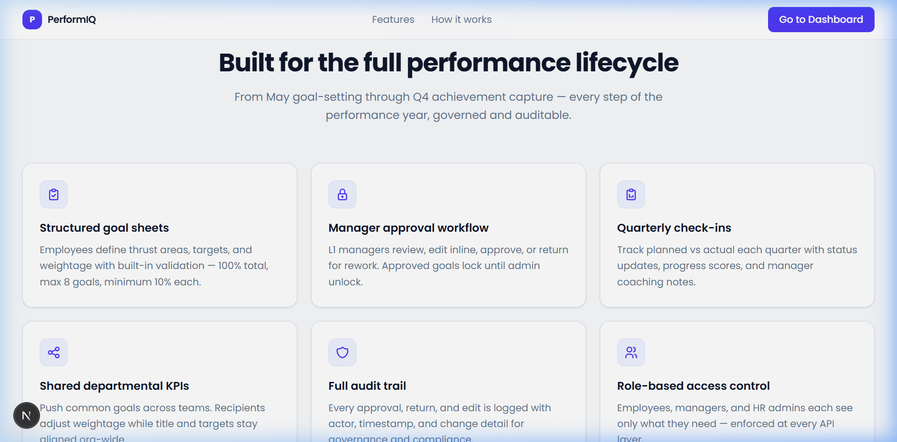

# PerformIQ

**Enterprise performance lifecycle management platform.**  
Structured goal-setting, manager approval workflows, quarterly KPI tracking, and governance audit trails — in one role-based application.



---

## Overview

PerformIQ replaces spreadsheets and email chains with a structured, auditable workflow covering the full annual performance cycle:

```
Employee sets goals → Manager reviews & approves → Quarterly actuals entered → Admin governs & reports
```

Built for **AtomQuest** as a hackathon demonstration of an enterprise HRTech platform.

---

## Key Features

| Feature | Description |
|---------|-------------|
| **Role-based access** | Employee, Manager, Admin — each with scoped routes and capabilities |
| **Goal lifecycle** | DRAFT → SUBMITTED → RETURNED → LOCKED with full validation |
| **Weightage enforcement** | 100% total, 10% minimum per goal, max 8 goals per sheet |
| **Manager review** | Inline edit, approve & lock, or return with feedback |
| **Quarterly check-ins** | UOM-aware inputs (numeric, percent, timeline, zero-defect) with progress scoring |
| **Shared KPIs** | Admin assigns org-wide goals to multiple employees simultaneously |
| **Admin dashboard** | Recharts analytics: submission pipeline, achievement mix, manager completion |
| **Audit trail** | Immutable log of all lifecycle events with before/after diffs |
| **CSV export** | Performance data export for compliance reporting |
| **Authentication** | Credentials + OAuth (Google, GitHub), JWT sessions |

---

## Tech Stack

| Layer | Technology |
|-------|------------|
| Framework | Next.js 16 (App Router) |
| Language | TypeScript 5 |
| Styling | Tailwind CSS 4, shadcn/ui |
| Auth | NextAuth v5 (JWT, Credentials + OAuth) |
| ORM | Drizzle ORM |
| Database | PostgreSQL (Neon) |
| Charts | Recharts 3 |
| Email | Resend (optional; console fallback in dev) |

---

## Quick Start

**Prerequisites:** Node.js 20+, pnpm, PostgreSQL (Neon recommended)

```bash
pnpm install
cp .example.env .env.local
# Set DATABASE_URL and AUTH_SECRET in .env.local
pnpm drizzle:push
pnpm seed:atomquest
pnpm dev
```

Open [http://localhost:3000](http://localhost:3000).

```bash
# Production build
pnpm build && pnpm start
```

---

## Demo Accounts

**Password for all accounts:** `AtomQuest@123`  
One-click fill buttons are available on the login page.

| Role | Email | Pre-seeded state |
|------|-------|------------------|
| **Admin** | `admin@atomquest.demo` | Full org data, charts, audit entries |
| **Manager** | `manager@atomquest.demo` | Team of 5 employees in mixed states |
| **Employee** | `employee@atomquest.demo` | DRAFT — create and submit live |
| **Employee** | `priya.sharma@atomquest.demo` | SUBMITTED — awaiting review |
| **Employee** | `arjun.mehta@atomquest.demo` | LOCKED + check-in + shared KPI |
| **Employee** | `sam.okonkwo@atomquest.demo` | LOCKED + completed Q1 check-in |
| **Employee** | `jordan.lee@atomquest.demo` | RETURNED — feedback received |

---

## RBAC

| Role | Home | Capabilities |
|------|------|-------------|
| Employee | `/goals` | Own goal sheet, submit, quarterly check-in |
| Manager | `/team` | Direct reports, review, approve/return, check-in comments |
| Admin | `/admin/atomquest` | Org-wide analytics, audit trail, shared KPIs, CSV export |

---

## Scripts

| Command | Description |
|---------|-------------|
| `pnpm dev` | Development server |
| `pnpm build` | Production build |
| `pnpm seed:atomquest` | Seed demo data |
| `pnpm drizzle:push` | Push schema to DB (dev) |
| `pnpm drizzle:studio` | Open Drizzle Studio |
| `pnpm typecheck` | TypeScript type check |

---

## Documentation

| Document | Description |
|----------|-------------|
| [docs/SHOWCASE.md](./docs/SHOWCASE.md) | Visual screenshot showcase |
| [docs/APPLICATION_WALKTHROUGH.md](./docs/APPLICATION_WALKTHROUGH.md) | User workflow guide (employee/manager/admin) |
| [docs/IMPLEMENTATION.md](./docs/IMPLEMENTATION.md) | Master technical implementation reference |
| [docs/ARCHITECTURE.md](./docs/ARCHITECTURE.md) | System flows and data models |
| [docs/API.md](./docs/API.md) | HTTP API reference |
| [docs/AUTH_RBAC.md](./docs/AUTH_RBAC.md) | Authentication and role model |
| [docs/DATABASE.md](./docs/DATABASE.md) | Schema and relationships |
| [docs/TECHNICAL_GUIDE.md](./docs/TECHNICAL_GUIDE.md) | Architecture evolution and scaling |
| [docs/SETUP.md](./docs/SETUP.md) | Detailed local setup guide |
| [docs/DEPLOYMENT.md](./docs/DEPLOYMENT.md) | Production deployment |
| [CONTRIBUTING.md](./CONTRIBUTING.md) | Contribution guide |
| [docs/KNOWN_LIMITATIONS.md](./docs/KNOWN_LIMITATIONS.md) | Known constraints |
| [APPLICATION_WALKTHROUGH.md](./docs/APPLICATION_WALKTHROUGH.md) |
